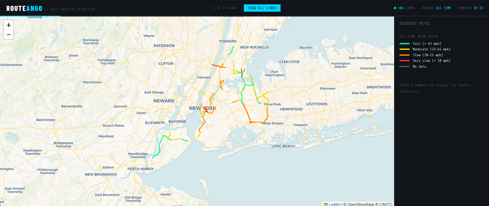
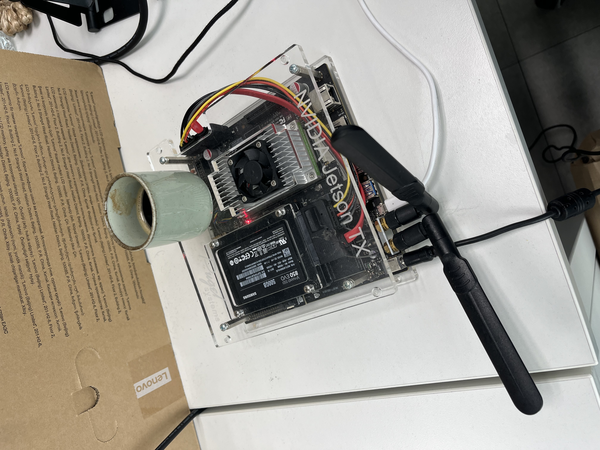

# ROUTANGO — NYC Traffic Visualizer

A real-time NYC traffic anomaly detector running on a Jetson TX2. Pulls live speed data from the NYC DOT API, builds a statistical baseline over time, and displays z-score based congestion anomalies on an interactive map — so you can see not just *that* traffic is slow, but *how much slower than usual* it is for that exact road, day, and time of day.

---

## How It Works

Most traffic maps show absolute speed — red means slow, green means fast. ROUTANGO is different. It compares live speed against a historical baseline built from weeks of data, segmented by **day of week** and **30-minute time bucket**. The result is a z-score per road link:

- **Z-score near 0** → traffic is normal for this time
- **Z-score > 2** → significantly slower than usual (congested)
- **Z-score < -2** → unusually fast

The baseline uses **Welford's online algorithm** — a numerically stable method for computing running mean and variance without storing all historical readings. The system gets smarter over time without growing its memory footprint.

---

## Screenshots

### Rush Hour Anomalies

*[REPLACE: screenshot of map showing congestion z-scores during NYC rush hour]*

### Normal Conditions

*[REPLACE: screenshot of map showing low z-scores during off-peak hours]*

### All Links View

*[REPLACE: screenshot of all 125 monitored road links rendered on the map]*

---

## Architecture

```
NYC DOT API (every 5 min)
        ↓
   poller.py          — fetches new readings, stores to SQLite
        ↓ SIGUSR1
   stats.py           — Welford update per (link, day_of_week, bucket)
        ↓
   server.py          — REST API + static file server
        ↓
  visualizer.html     — ROUTANGO map interface (Leaflet.js, dark UI)
```

Three systemd services run continuously on the Jetson TX2:
- `nyc-traffic-poller` — polls NYC DOT every 5 minutes
- `nyc-traffic-stats` — wakes on SIGUSR1, updates statistical baselines
- `nyc-traffic-visualizer` — serves the map on port 8080

Data is stored in SQLite on an SSD at `/mnt/ssd/nyc_traffic.db`.

---

## Statistical Design

### Baseline Building
Each road link gets its own baseline per `(day_of_week, 30-min bucket)` combination — 7 × 48 = 336 possible slots per link. After one full week of data, every slot has at least one observation. After several weeks, the baselines become robust.

### Welford's Online Algorithm
Rather than storing all historical readings, the system maintains a running `(count, mean, M2)` tuple per slot. Standard deviation is computed on demand as `sqrt(M2 / count)`. Memory-efficient and numerically stable.

### Z-Score Congestion Detection
```
z = (historical_mean - live_speed) / historical_stddev
```
Positive z = slower than usual. The frontend colors links by z-score magnitude.

---

## Data Source

Live data from the [NYC DOT Real-Time Traffic Speed Data](https://data.cityofnewyork.us/Transportation/Real-Time-Traffic-Speed-Data/qkm5-nuaq) via the Socrata API. Covers **125 road links** across NYC boroughs, updated approximately every 5 minutes.

**Note:** The NYC DOT stops publishing data late at night (roughly 23:00–06:00 NYC time). This is expected behavior — ROUTANGO is most useful during business hours, roughly **15:00–23:00 CET** if you're in Europe.

---

## Setup

### Requirements
- NVIDIA Jetson TX2 (or any Linux system with Python 3)
- SSD mounted at `/mnt/ssd/` for the SQLite database
- Socrata API token (free at [data.cityofnewyork.us](https://data.cityofnewyork.us))

### Install
```bash
git clone https://github.com/yourusername/nyc-traffic-visualizer
cd nyc-traffic-visualizer
pip3 install pytz
```

### Configure
Create a `.env` file:
```
SOCRATA_APP_TOKEN=your_token_here
```

### Run as systemd services
```bash
sudo cp nyc-traffic-*.service /etc/systemd/system/
sudo systemctl daemon-reload
sudo systemctl enable nyc-traffic-poller nyc-traffic-stats nyc-traffic-visualizer
sudo systemctl start nyc-traffic-poller nyc-traffic-stats nyc-traffic-visualizer
```

### Access the map
```bash
# Local
http://localhost:8080

# Remote via SSH port forward
ssh -L 8080:localhost:8080 ubuntu@<jetson-ip>
# then open http://localhost:8080
```

### Utilities
```bash
# Test API connectivity
python3 test_count.py "SELECT * WHERE link_id='4362249'"
```

---

## Database Schema

```sql
links       — road link metadata (name, borough, encoded polyline)
readings    — raw speed readings with timestamps  
link_stats  — Welford state per (link_id, day_of_week, bucket)
```

---

## Hardware

Running on an **NVIDIA Jetson TX2** with an external SSD for the database and some expresso for that extra punch.



---

## Notes

- Needs ~1 week of data before baselines are meaningful
- The map shows **anomalies**, not absolute speed — a road that's always congested won't score high
- Friday baselines are thinner than other weekdays due to overnight API gaps